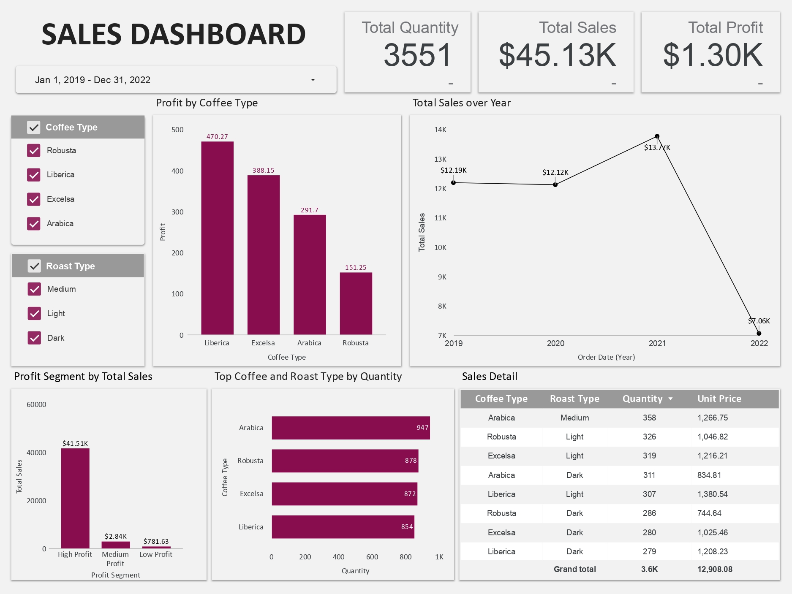
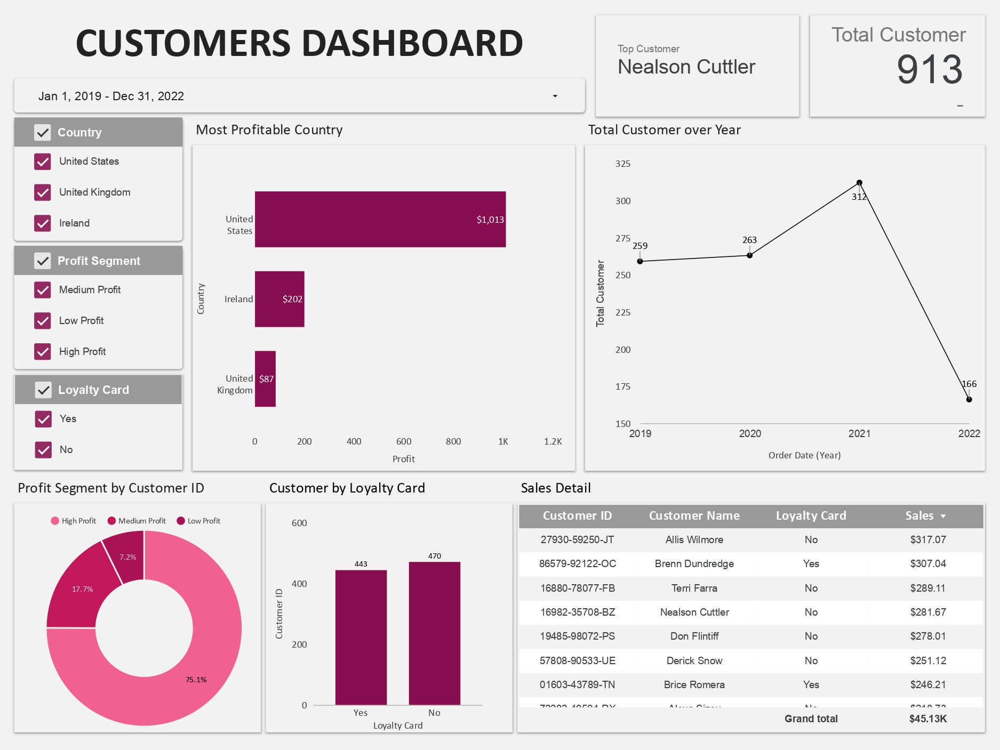

# Sales Dashboard using Looker Studio: A Data Analytics Project

## Brief Description about this Project
This project focuses on preparing and cleaning sales data in Google Sheets, then importing it into Google Looker Studio to build an interactive dashboard for analyzing customer, product, and profit performance.

All files for this project can be found in the assets folder. The Google Sheets worksheet can be accessed [here](https://docs.google.com/spreadsheets/d/1wa8ulH8iiOfSBkyEJqEhBvSGMDcTD60xle7uKJ-6DBw/edit?usp=sharing), and the Google Looker Studio dashboard can be accessed [here](https://lookerstudio.google.com/reporting/24316dd9-a3ca-4905-8a62-c4709229a965).

## Data Description
The dataset used in this project is downloaded from [Kaggle](https://www.kaggle.com/datasets/saadharoon27/coffee-bean-sales-raw-dataset). It contains three tables/worksheets: **Orders Worksheet**, **Customers Worksheet**, and **Products Worksheet**, with their respective columns/variables described below.

**Orders Worksheet:**

1. Order ID: A unique identifier for each coffee order.
2. Order Date: The date when the order was placed.
3. Customer ID: An identifier linking the order to a specific customer.
4. Product ID: A unique identifier for each coffee product.
5. Quantity: The quantity of the coffee product ordered.

**Customers Worksheet:**

1. Customer ID: A unique identifier for each customer.
2. Customer Name: The name of the customer.
3. Email Address: Contact information for customers.
4. Phone Number: Another contact detail for customers.
5. And more: Explore a wide range of customer attributes for segmentation and analysis.

**Products Worksheet:**

1. Product ID: A unique identifier for each coffee product.
2. Coffee Type: The type or blend of coffee, such as Arabica or Robusta.
3. Roast Type: The roast level, including light, medium, or dark roast.
4. Size: Information about the product size.
5. Unit Price: The price of a single unit of the coffee product.
6. Price Per 100g: The price per 100 grams for detailed price comparisons.
7. Profit: Insights into the profitability of each coffee product.

## Data Preparation and Cleaning (Google Sheets)
**Customers Worksheet:**
  - Fill null value in email column as "No Email" using IF function.
    <details>
       <summary>Formula</summary>
        
      ```excel
      =IF(C2="","No Email",C2)
      ```
    </details>
      
   - Fill null value in phone number column as "No Phone Number" using IF function.
      <details>
         <summary>Formula</summary>
          
        ```excel
        =IF(E2="","No Phone Number",E2)
        ```
      </details>
**Products Worksheet**:
  -  Add `"kg"` unit label to **Size** column using custom number format.
  -  Convert **Unit Price**, **Price per 100g**, and **Profit** columns into **currency format**.
  -  Standardize abbreviations in **Coffee Type** and **Roast Type** using `IFS` function.
      <details>
         <summary>Formula</summary>
          
        ```excel
        **Coffee Type**
         =IFS(B2="Ara","Arabica",B2="Rob","Robusta",B2="Lib","Liberica",B2="Exc","Excelsa")

        **Roast Type**
        =IFS(C2="L","Light",C2="M","Medium",C2="D","Dark")
        ```
      </details>
Format all worksheet into table.

## Dashboard Development (Looker Studio)

#### Data Integration and Import (Looker Studio)

- Import cleaned data from Google Sheets into Looker Studio.
- Validate and adjust data types (dates, numeric, currency).

#### Dashboard Design

Create a **double-page dashboard**:
  * **Products Dashboard** → product performance, sales, and profitability.
  * **Customers Dashboard** → customer distribution, segmentation, and behavior.

#### Charts and Visualizations:

📊 Page 1: **Products Dashboard**

<p align="center">
  <kbd> </kbd> <br>
  Products Dashboard
</p>

**Dashboard Summary:**
The sales dashboard shows total sales of $45.13K with a profit of $1.30K across 3,551 units (2019–2022). Liberica and Excelsa generated the highest profit, while Arabica and Light Roast led in sales volume. However, Liberica and Dark Roast variants underperformed in sales volueme. Sales peaked in 2021 but declined sharply in 2022, highlighting the need for renewed marketing or supply chain adjustments. Focus should remain on high-performing coffee types and profitable roast segments while revisiting pricing and strategy for weaker products.

**Products Dashboard Description:**

**Total Sales, Profit, and Quantity (Scorecards)**
  - Define new metric  `SUM(Unit Price × Quantity)` for the **Total Sales** scorecards.
  - Using `SUM(Profit)`  for the **Total Profit** scorecards.
  - Using `SUM(Quantity)` for the **Total Quantity** scorecards.

 **Sales Trend Over Time (Line Chart)**
  - Use `Order Date (Year)` as the **dimension** to track sales trends over time.
  - Use `SUM(Total Sales)` as the main **metric**, with `SUM(Profit)` as an optional metric.

 **Profitability by Coffee Type (Bar Chart)**
  - Use `Coffee Type` as the **dimension** to compare profitability across product categories.
  - Use `SUM(Profit)` as the **metric** for measuring total profit.

 **Total Sales vs Profit Segment (Bar Chart)**
  - Define a **Profit Segment** by grouping into bins: Low Profit (<25%), Medium Profit (25%–50%), and High Profit (>50%) as **dimension**.
  - Use `SUM(Profit)` as the **metric** to compare performance across segments.

 **Top Products by Quantity (Horizontal Bar Chart)**
  - Use `Coffee Type` or `Roast Type` as the **dimension** to rank products.
  - Use `SUM(Quantity)` as the **metric** to measure total sales volume.

 **Sales Detail (Tables)**
  - Use `Coffee Type` and `Roast Type` as the **dimension** to break down sales.
  - Use `SUM(Quantity)` and `SUM(Unit Price)` as the **metrics** to display detailed sales information.

 **Parameter**
  - Add a **Date Range** parameter to filter data by time.
  - Add a **Fixed List** parameter to filter by `Coffee Type` and `Roast Type`.

👥 Page 2: **Customers Dashboard**

<p align="center">
  <kbd> </kbd> <br>
  Customers Dashboard
</p>

**Dashboard Summary:**
The customers dashboard records 913 total customers between 2019–2022, with the United States contributing the majority of profits ($1,013), while Ireland and the United Kingdom lag far behind. Customer growth peaked in 2021 (312 customers) but fell sharply in 2022 (166), indicating potential retention challenges. High-profit customers dominate (75.1%), yet loyalty card adoption shows no clear impact on sales performance. Future strategy should focus on retaining high-value customers, strengthening loyalty incentives, and expanding market share outside the U.S. to balance profitability.

**Customers Dashboard Description:**

**Top Customer and Total Customer (Scorecards)**
  - Using `Customer Name` as **dimension**, sorted by `Profit`, for the **Top Customer** scorecards .
  - Using `COUNT_DISTINC(Customer ID)` for the **Total Customer** scorecards.

 **Customer Growth Over Time (Line Chart)**
  - Use `Order Date (Year)` as the **dimension** to track customer growth over time.
  - Use `COUNT_DISTINC(Customer ID)` as the **metric** to measure the number of unique customers.

 **Customer Distribution by Country (Bar Chart)**
  - Use `Country` as the **dimension** to compare customer distribution across regions.
  - Use `SUM(Profit)` as the main metric, with `COUNT_DISTINC(Customer ID)` as an optional metric.

 **Customers by Loyalty Card (Bar Chart)**
  - Use `Loyalty Card` as the **dimension** to categorize customers.
  - Use `COUNT_DISTINC(Customer ID)` as the metric to **measure** the number of customers by loyalty card status.

 **Sales Detail (Tables)**
  - Use `Customer ID`, `Customer Name`, and  `Loyalty Card` as the **dimension** to break down sales.
  - Use `SUM(Sales)` as the **metrics** to display detailed sales information.

 **Parameter**
  - Add a **Date Range** parameter to filter data by time.
  - Add a **Fixed List** parameter to filter by `Country`, `Profit Segment`, and `Loyalty Card`.

## Summary
* Sales reached **\$45.13K** with **\$1.30K profit** across **3,551 units** and **913 customers** (2019–2022).
* **Liberica** and **Excelsa** were most profitable; **Arabica and Light Roast** led in volume.
* **Robusta** and **Dark Roast** underperformed in both sales and profit.
* Sales peaked in **2021** but dropped sharply in **2022**, signaling retention issues.
* The **U.S. market dominated profits** (\$1,013), while Ireland and the UK contributed little.
* Recommendations: focus on top products, improve loyalty programs, and expand into new markets.
